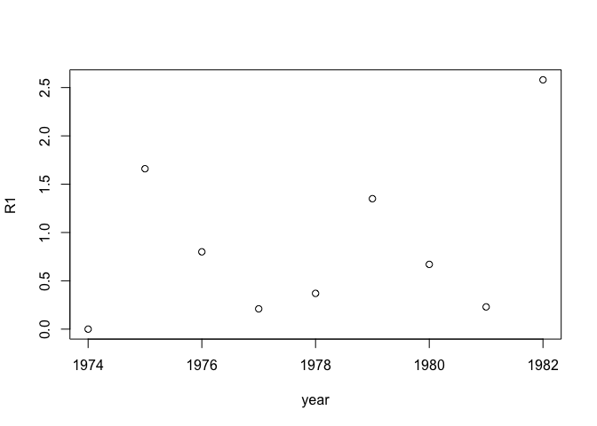

agridat
================
ziqiang tang

R Markdown
----------

This is an R Markdown document. Markdown is a simple formatting syntax for authoring HTML, PDF, and MS Word documents. For more details on using R Markdown see <http://rmarkdown.rstudio.com>.

When you click the **Knit** button a document will be generated that includes both content as well as the output of any embedded R code chunks within the document. You can embed an R code chunk like this:

First let's load the agridat package:

``` r
library(agridat)
```

Then, let's return the first/last 6 rows:

``` r
head(aastveit.barley.covs)    ##the default rows n=6L
```

    ##   year   R1   R2   R3   R4   R5   R6   S1   S2   S3   S4   S5   S6 ST
    ## 1 1974 0.00 0.16 1.59 2.65 1.70 2.21 2.26 2.74 2.57 2.25 2.67 2.36 17
    ## 2 1975 1.66 1.84 1.68 0.08 0.02 0.01 1.94 1.85 2.37 3.02 3.15 2.95 21
    ## 3 1976 0.80 2.05 0.81 0.40 1.02 1.06 2.01 2.31 2.27 2.96 2.66 2.81 26
    ## 4 1977 0.21 3.62 0.36 3.46 0.15 4.65 2.89 2.06 2.98 2.82 2.44 1.89 48
    ## 5 1978 0.37 0.66 0.75 6.72 3.32 0.88 1.84 2.29 2.66 1.77 2.03 2.35 35
    ## 6 1979 1.35 3.92 1.05 2.22 0.86 2.49 1.63 2.21 2.34 2.40 2.13 2.27 39
    ##      T1    T2    T3    T4    T5    T6
    ## 1  8.36  9.60 12.11 12.13 18.43 13.75
    ## 2  7.66 11.66 10.06 15.95 16.49 18.34
    ## 3  7.50 12.13 13.08 17.44 18.88 18.66
    ## 4 12.72 12.73 17.39 17.43 13.78 13.88
    ## 5  8.44 16.43 15.63 13.91 14.54 13.81
    ## 6  8.14 15.13 14.47 14.05 15.83 14.96

``` r
tail(aastveit.barley.covs,-6) ##the last 6 rows
```

    ##   year   R1   R2   R3   R4   R5   R6   S1   S2   S3   S4   S5   S6 ST
    ## 7 1980 0.67 3.45 2.75 6.20 1.05 3.60 2.76 1.85 2.25 1.98 2.13 1.79 35
    ## 8 1981 0.23 3.20 4.36 3.01 4.14 0.54 2.33 1.79 2.07 1.71 2.24 2.46 38
    ## 9 1982 2.58 3.29 0.01 2.76 3.31 2.54 1.78 1.72 2.80 2.29 2.13 2.48 27
    ##      T1    T2    T3    T4    T5    T6
    ## 7 12.57 11.51 17.91 13.90 16.15 14.84
    ## 8 14.90 12.81 11.85 13.63 16.40 15.82
    ## 9  7.16 10.63 15.83 11.56 13.16 18.91

Next, let's show the structure of this object

``` r
str(aastveit.barley.covs, digits.d = 3)    ##default digits is 3
```

    ## 'data.frame':    9 obs. of  20 variables:
    ##  $ year: int  1974 1975 1976 1977 1978 1979 1980 1981 1982
    ##  $ R1  : num  0 1.66 0.8 0.21 0.37 1.35 0.67 0.23 2.58
    ##  $ R2  : num  0.16 1.84 2.05 3.62 0.66 3.92 3.45 3.2 3.29
    ##  $ R3  : num  1.59 1.68 0.81 0.36 0.75 1.05 2.75 4.36 0.01
    ##  $ R4  : num  2.65 0.08 0.4 3.46 6.72 2.22 6.2 3.01 2.76
    ##  $ R5  : num  1.7 0.02 1.02 0.15 3.32 0.86 1.05 4.14 3.31
    ##  $ R6  : num  2.21 0.01 1.06 4.65 0.88 2.49 3.6 0.54 2.54
    ##  $ S1  : num  2.26 1.94 2.01 2.89 1.84 1.63 2.76 2.33 1.78
    ##  $ S2  : num  2.74 1.85 2.31 2.06 2.29 2.21 1.85 1.79 1.72
    ##  $ S3  : num  2.57 2.37 2.27 2.98 2.66 2.34 2.25 2.07 2.8
    ##  $ S4  : num  2.25 3.02 2.96 2.82 1.77 2.4 1.98 1.71 2.29
    ##  $ S5  : num  2.67 3.15 2.66 2.44 2.03 2.13 2.13 2.24 2.13
    ##  $ S6  : num  2.36 2.95 2.81 1.89 2.35 2.27 1.79 2.46 2.48
    ##  $ ST  : int  17 21 26 48 35 39 35 38 27
    ##  $ T1  : num  8.36 7.66 7.5 12.72 8.44 ...
    ##  $ T2  : num  9.6 11.7 12.1 12.7 16.4 ...
    ##  $ T3  : num  12.1 10.1 13.1 17.4 15.6 ...
    ##  $ T4  : num  12.1 15.9 17.4 17.4 13.9 ...
    ##  $ T5  : num  18.4 16.5 18.9 13.8 14.5 ...
    ##  $ T6  : num  13.8 18.3 18.7 13.9 13.8 ...

``` r
covsdf <- data.frame(aastveit.barley.covs) ##store the data fram
str(covsdf)                                ##show new structure
```

    ## 'data.frame':    9 obs. of  20 variables:
    ##  $ year: int  1974 1975 1976 1977 1978 1979 1980 1981 1982
    ##  $ R1  : num  0 1.66 0.8 0.21 0.37 1.35 0.67 0.23 2.58
    ##  $ R2  : num  0.16 1.84 2.05 3.62 0.66 3.92 3.45 3.2 3.29
    ##  $ R3  : num  1.59 1.68 0.81 0.36 0.75 1.05 2.75 4.36 0.01
    ##  $ R4  : num  2.65 0.08 0.4 3.46 6.72 2.22 6.2 3.01 2.76
    ##  $ R5  : num  1.7 0.02 1.02 0.15 3.32 0.86 1.05 4.14 3.31
    ##  $ R6  : num  2.21 0.01 1.06 4.65 0.88 2.49 3.6 0.54 2.54
    ##  $ S1  : num  2.26 1.94 2.01 2.89 1.84 1.63 2.76 2.33 1.78
    ##  $ S2  : num  2.74 1.85 2.31 2.06 2.29 2.21 1.85 1.79 1.72
    ##  $ S3  : num  2.57 2.37 2.27 2.98 2.66 2.34 2.25 2.07 2.8
    ##  $ S4  : num  2.25 3.02 2.96 2.82 1.77 2.4 1.98 1.71 2.29
    ##  $ S5  : num  2.67 3.15 2.66 2.44 2.03 2.13 2.13 2.24 2.13
    ##  $ S6  : num  2.36 2.95 2.81 1.89 2.35 2.27 1.79 2.46 2.48
    ##  $ ST  : int  17 21 26 48 35 39 35 38 27
    ##  $ T1  : num  8.36 7.66 7.5 12.72 8.44 ...
    ##  $ T2  : num  9.6 11.7 12.1 12.7 16.4 ...
    ##  $ T3  : num  12.1 10.1 13.1 17.4 15.6 ...
    ##  $ T4  : num  12.1 15.9 17.4 17.4 13.9 ...
    ##  $ T5  : num  18.4 16.5 18.9 13.8 14.5 ...
    ##  $ T6  : num  13.8 18.3 18.7 13.9 13.8 ...

Now, let's get the number of rows or columns present in this object

``` r
nrow(aastveit.barley.covs)  ##9 rows
```

    ## [1] 9

``` r
ncol(aastveit.barley.covs)  ##20 columns
```

    ## [1] 20

``` r
dim(aastveit.barley.covs)   ##9 rows, 20 colums
```

    ## [1]  9 20

Now, let's see the summary of each column

``` r
summary(aastveit.barley.covs) ##include min, max, mean, median
```

    ##       year            R1               R2              R3       
    ##  Min.   :1974   Min.   :0.0000   Min.   :0.160   Min.   :0.010  
    ##  1st Qu.:1976   1st Qu.:0.2300   1st Qu.:1.840   1st Qu.:0.750  
    ##  Median :1978   Median :0.6700   Median :3.200   Median :1.050  
    ##  Mean   :1978   Mean   :0.8744   Mean   :2.466   Mean   :1.484  
    ##  3rd Qu.:1980   3rd Qu.:1.3500   3rd Qu.:3.450   3rd Qu.:1.680  
    ##  Max.   :1982   Max.   :2.5800   Max.   :3.920   Max.   :4.360  
    ##        R4              R5             R6              S1      
    ##  Min.   :0.080   Min.   :0.02   Min.   :0.010   Min.   :1.63  
    ##  1st Qu.:2.220   1st Qu.:0.86   1st Qu.:0.880   1st Qu.:1.84  
    ##  Median :2.760   Median :1.05   Median :2.210   Median :2.01  
    ##  Mean   :3.056   Mean   :1.73   Mean   :1.998   Mean   :2.16  
    ##  3rd Qu.:3.460   3rd Qu.:3.31   3rd Qu.:2.540   3rd Qu.:2.33  
    ##  Max.   :6.720   Max.   :4.14   Max.   :4.650   Max.   :2.89  
    ##        S2              S3              S4              S5       
    ##  Min.   :1.720   Min.   :2.070   Min.   :1.710   Min.   :2.030  
    ##  1st Qu.:1.850   1st Qu.:2.270   1st Qu.:1.980   1st Qu.:2.130  
    ##  Median :2.060   Median :2.370   Median :2.290   Median :2.240  
    ##  Mean   :2.091   Mean   :2.479   Mean   :2.356   Mean   :2.398  
    ##  3rd Qu.:2.290   3rd Qu.:2.660   3rd Qu.:2.820   3rd Qu.:2.660  
    ##  Max.   :2.740   Max.   :2.980   Max.   :3.020   Max.   :3.150  
    ##        S6              ST              T1               T2       
    ##  Min.   :1.790   Min.   :17.00   Min.   : 7.160   Min.   : 9.60  
    ##  1st Qu.:2.270   1st Qu.:26.00   1st Qu.: 7.660   1st Qu.:11.51  
    ##  Median :2.360   Median :35.00   Median : 8.360   Median :12.13  
    ##  Mean   :2.373   Mean   :31.78   Mean   : 9.717   Mean   :12.51  
    ##  3rd Qu.:2.480   3rd Qu.:38.00   3rd Qu.:12.570   3rd Qu.:12.81  
    ##  Max.   :2.950   Max.   :48.00   Max.   :14.900   Max.   :16.43  
    ##        T3              T4              T5              T6       
    ##  Min.   :10.06   Min.   :11.56   Min.   :13.16   Min.   :13.75  
    ##  1st Qu.:12.11   1st Qu.:13.63   1st Qu.:14.54   1st Qu.:13.88  
    ##  Median :14.47   Median :13.91   Median :16.15   Median :14.96  
    ##  Mean   :14.26   Mean   :14.44   Mean   :15.96   Mean   :15.89  
    ##  3rd Qu.:15.83   3rd Qu.:15.95   3rd Qu.:16.49   3rd Qu.:18.34  
    ##  Max.   :17.91   Max.   :17.44   Max.   :18.88   Max.   :18.91

Including Plots
---------------

You can also embed plots, for example:

lets's plot the R1 vs year

``` r
plot(R1 ~ year, aastveit.barley.covs)
```



Note that the `echo = FALSE` parameter was added to the code chunk to prevent printing of the R code that generated the plot.
